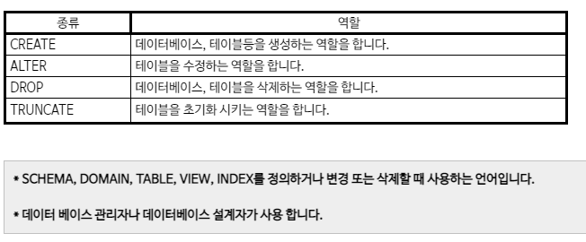
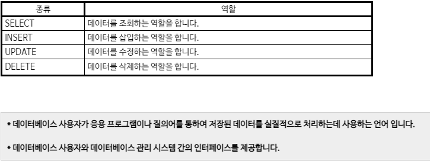
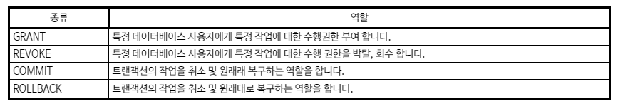
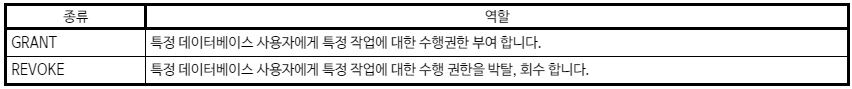
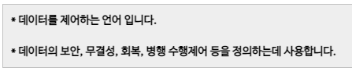

# SQL 기초

## ORDER BY

첫번째 조건이 동일한 경우 다음 조건으로 정렬한다.

``` sql
select
	first_name
	,last_name
	from
		customer
	order by first_name ASC - default는 ASC
	-- order by first_name asc 라고 하면 틀리다.
			,last_name DESC
;
```

ORDER BY절에 정수를 넣었을 때 SELECT 문의 column 순서에 매칭하여 진행됨. 위와 동일한 결과 (하지만 전자의 방법이 좀 더 가독성, 유지보수 측면에서 추천된다.)

```sql
select
	first_name
	,last_name
	from
		customer
	order by 1 ASC - default는 ASC
			,2 DESC
;
```

## DISTINCT

SELECT시 중복값을 제외한 결과를 출력


## 기타

### 실행계획

`ctrl+shift+e` 키로 실행계획을 볼 수 있음. DBMS 내부에서 어떤 동작을 취했는지 확인할 수 있다.


- Seq Scan : customer table의 모든 정보를 가져오기 위해서 처음부터 끝까지 다 읽었다.
- 0.129초가 걸렸다.


### ALIAS

- 코드의 가독성을 높여준다 
- SQL의 성능을 높혀준다. 
  - 기본적으로 DBMS은 옵티마이저(최적화도구)가 있는데, ALIAS을 사용하게 되면 SQL query에 대해 가장 빠르게, 가장 저비용으로 실행하는 데에 도움을 준다.

```sql
-- ALIAS 사용하기
select 
	A.first_name  
	,A.last_name
	,A.email
	
	from
		customer A
;
```


### DDL vs DML vs DCL

DDL(Data Definition Language)  - 데이터 정의어 란? 데이터베이스를 정의하는 언어이며, 데이터리를 생성, 수정, 삭제하는 등의 데이터의 전체의 골격을 결정하는 역할을 하는 언어 입니다.



``` SQL
CREATE TABLE T1 ( ID SERIAL NOT NULL PRIMARY KEY, BCOLOR VARCHAR, FCOLOR VARCHAR );

-- COMMIT; COMMIT이 필요하지 않다. DDL --> 치는 순간에 바로 적용 
```

DML(Data Manipulation Language) - 데이터 조작어란? 정의된 데이터베이스에 입력된 레코드를 조회하거나 수정하거나 삭제하는 등의 역할을 하는 언어를 말합니다.



``` sql
INSERT
  INTO T1 (BCOLOR, FCOLOR)
VALUES
         ('red', 'red')
       , ('red', 'red')
       , ('red', NULL)
       , (NULL, 'red')
       , ('red', 'green')
       , ('red', 'blue')
       , ('green', 'red')
       , ('green', 'blue')
       , ('green', 'green')
       , ('blue', 'red')
       , ('blue', 'green')
       , ('blue', 'blue')
;

COMMIT; -- TABLE을 생성하기 위해서는 COMMIT이 필수적으로 필요하다.
```

DCL(Data Control Language) - 데이터베이스에 접근하거나 객체에 권한을 주는등의 역할을 하는 언어를 입니다.







[Source](https://server-talk.tistory.com/159)


### NULL

NULL은 가장 마지막 값이다. DESC순으로 하였을 때 가장 먼저 올 수 있다.

